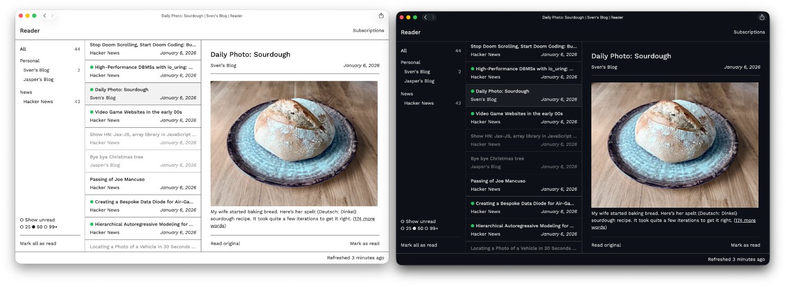

# Reader

A fast, lightweight RSS reader.



## Features

- Three-column layout: subscriptions, articles, reading pane
- Unread/read tracking with mark-all-as-read
- Pull to refresh on mobile
- YAML-based subscription management
- Dark mode

## Requirements

- PHP 8.4+
- Composer

## Installation

```bash
composer install
make db-create
make db-migrate
```

## Development

```bash
make serve
```

Open http://127.0.0.1:8000 in your browser.

## Production

TBD

## License

MIT
