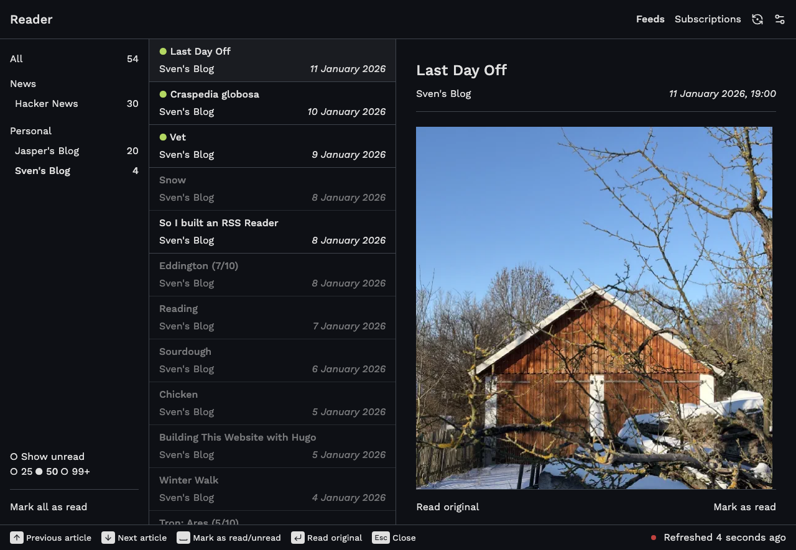
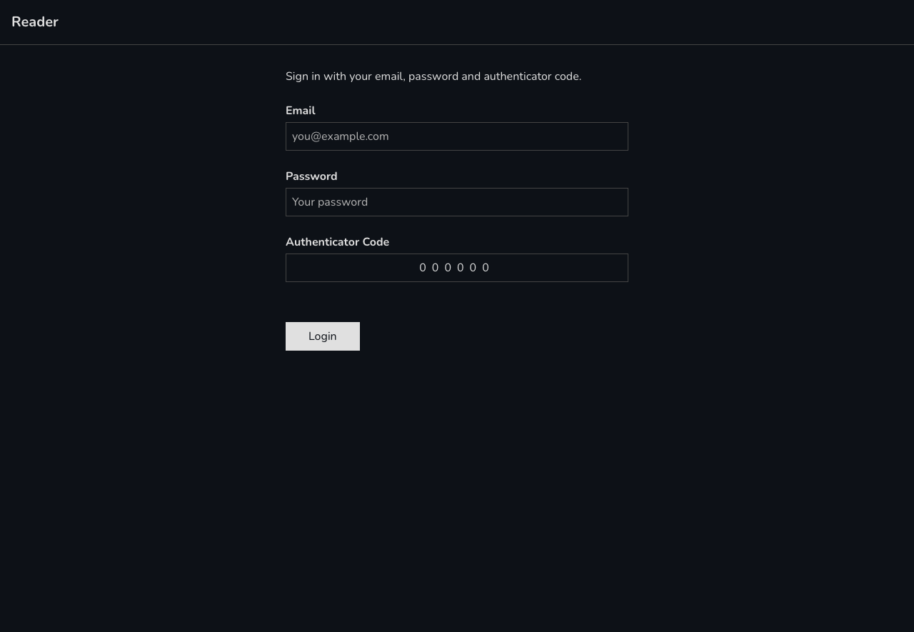
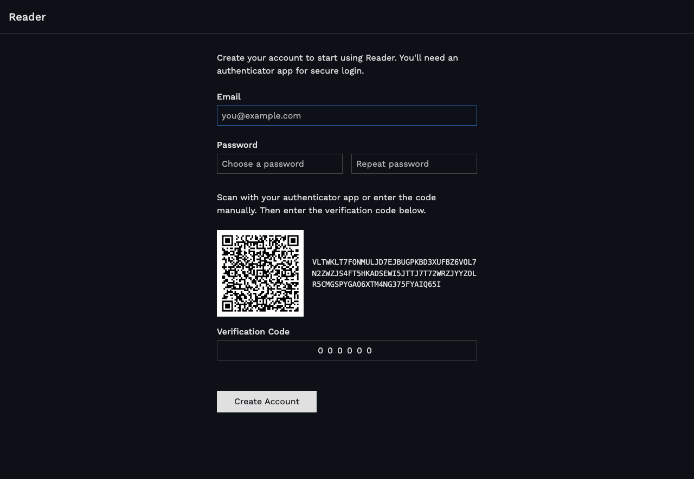
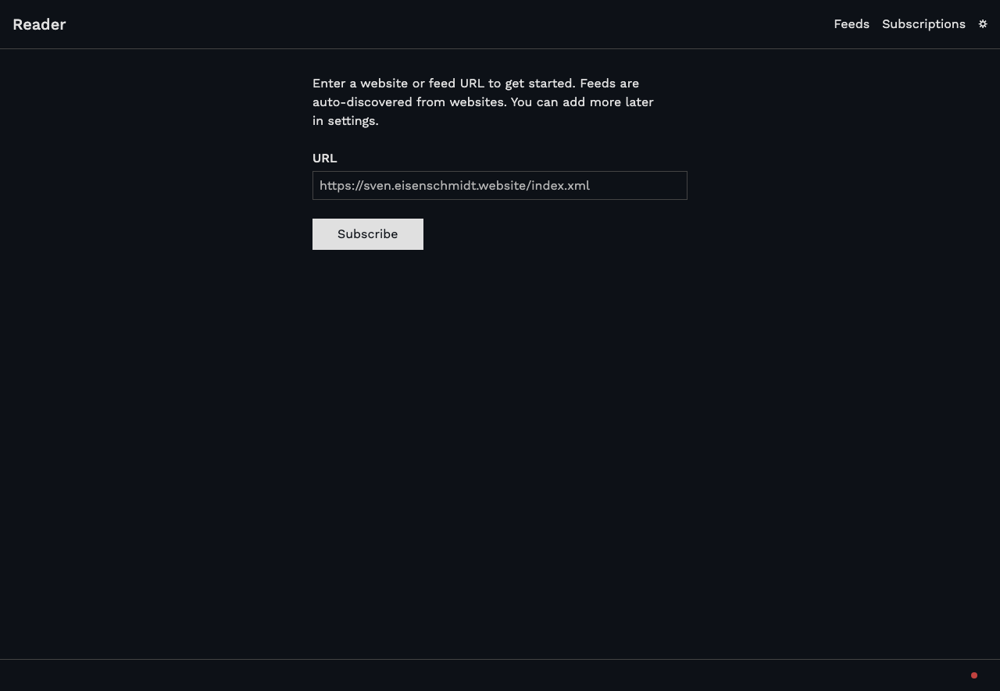
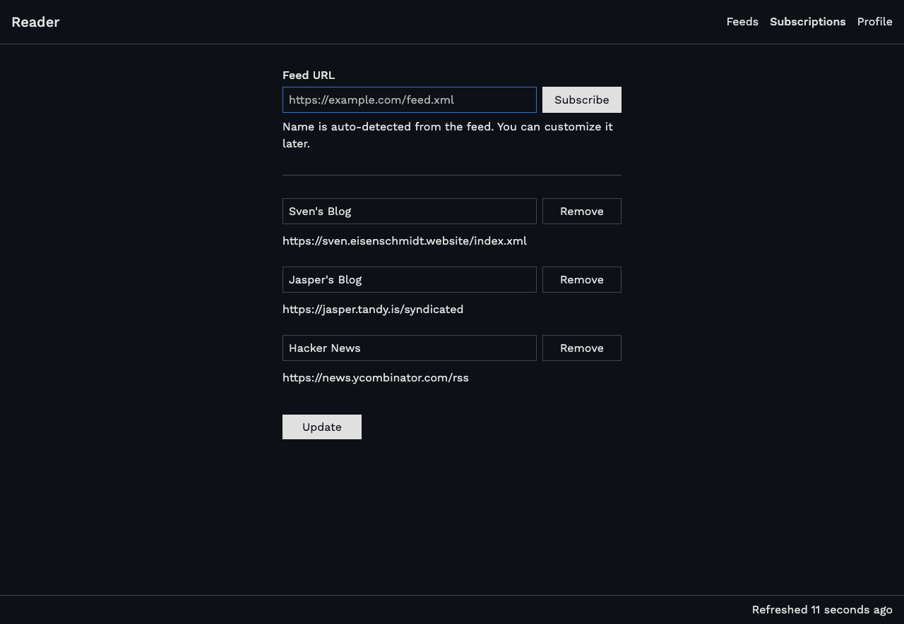
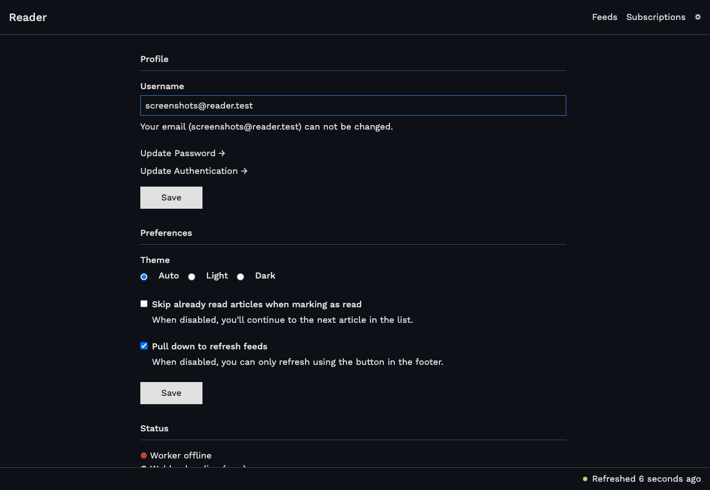
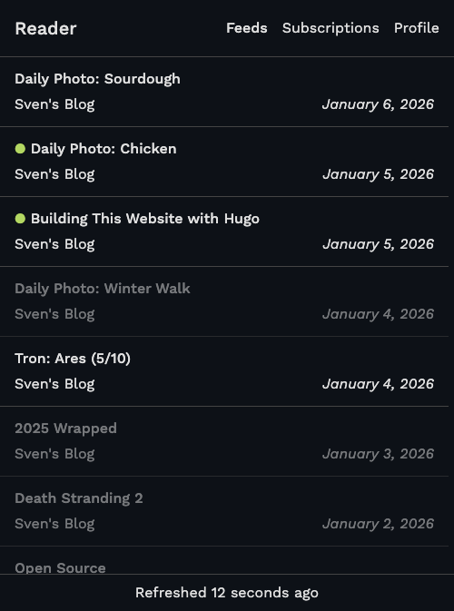
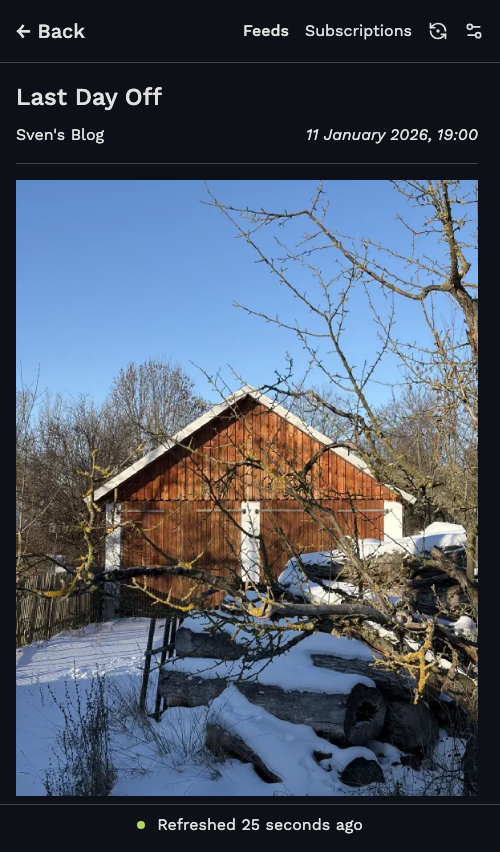

# Reader

A fast, minimal RSS reader for a single user.




## Getting Started

### First-Time Setup

When you open Reader for the first time, you'll be guided through a setup wizard:

1. **Create your account** - Enter your email and choose a password
2. **Set up two-factor authentication** - Scan the QR code with your authenticator app (Google Authenticator, Authy, 1Password, etc.)
3. **Verify** - Enter the 6-digit code from your authenticator to confirm it's working
4. **Add your first feed** - Paste an RSS feed URL to get started

### Logging In

Every login requires:
- Your email
- Your password
- A 6-digit code from your authenticator app

## Features

- Clean three-column layout: feeds, articles, reading pane
- Track read/unread articles
- Green dot shows new articles you haven't seen yet
- Pull down to refresh on any device
- Light, dark, and auto theme

## Using Reader

### Reading Articles

Click any article in the list to read it. The content appears in the reading pane on the right.

**Marking articles as read:**
- Click "Mark as read" on an article
- Click "Mark all as read" in the sidebar
- Click "Read original" to open the source and mark as read

The green dot next to new articles disappears once you've viewed them.

### Refreshing Feeds

Two ways to check for new articles:
- Pull down from the top of the page
- Click the "Refreshed..." text in the footer

Feeds also refresh automatically when the background worker is running (check Profile for status).

### Managing Your Feeds

Click **Subscriptions** in the header to add, edit, or remove feeds.

**Adding a feed:** Enter a feed URL and click "Subscribe".

**Editing a feed:** Change the title and click "Save".

**Removing a feed:** Click "Unsubscribe" next to the feed you want to remove.

### Filtering Articles

Use the filters in the sidebar:

- **Show unread** - Hide articles you've already read
- **25 / 50 / 99+** - Limit how many articles are shown

### Profile Settings

Click **Profile** in the header to change your settings:

- **Theme** - Choose between Auto, Light, or Dark mode
- **Worker Status** - Shows if background refresh is running

## Security

Reader is designed for single-user, self-hosted use:

- All pages require authentication
- Passwords are securely hashed
- Two-factor authentication (TOTP) is mandatory
- Sessions expire automatically

## Screenshots

### Login


### Setup


### Onboarding


### Subscriptions


### Profile


### Mobile



## Background Worker

Reader uses a background worker to automatically refresh feeds and clean up old content. The worker is built on Symfony Messenger with the Scheduler component.

### Scheduled Tasks

| Task | Description |
|------|-------------|
| Heartbeat | Logs a heartbeat entry to the database to indicate the worker is alive |
| Refresh Feeds | Fetches new articles from all subscribed feeds |
| Cleanup Content | Deletes articles older than 30 days |

Intervals are configured via environment variables (see below).

### Running the Worker

```bash
php bin/console messenger:consume scheduler_default
```

For production, use `--time-limit` (in seconds) to ensure periodic restarts:

```cron
0 * * * * cd /path/to/reader && php bin/console messenger:consume scheduler_default --time-limit=3540 >> var/log/worker.log 2>&1
```

This runs the worker hourly, with a 59-minute time limit (3540 seconds) to ensure it exits before the next cron run.

### Environment Variables

| Variable | Default | Description |
|----------|---------|-------------|
| `WORKER_REFRESH_INTERVAL` | 5 minutes | How often feeds are refreshed |
| `WORKER_CLEANUP_INTERVAL` | 1 day | How often old content is cleaned up |

### Worker Status

The Profile page shows whether the worker is running. This is determined by checking if the last heartbeat log entry was created within the last 30 seconds.

### Webhooks

As an alternative to the background worker, you can trigger tasks via HTTP webhooks. Webhooks use Basic Auth with dedicated credentials configured in your `.env`:

```env
WEBHOOK_USER=webhook
WEBHOOK_PASSWORD=your-secret-password
```

| Endpoint | Method | Description |
|----------|--------|-------------|
| `/webhook/refresh-feeds` | POST | Refreshes all subscribed feeds |
| `/webhook/cleanup-content` | POST | Deletes articles older than 30 days |

Example using curl:

```bash
curl -X POST -u "webhook:your-secret-password" https://your-reader.com/webhook/refresh-feeds
```

Example cron setup (refresh feeds every 5 minutes):

```cron
*/5 * * * * curl -s -X POST -u "webhook:your-secret-password" https://your-reader.com/webhook/refresh-feeds
```

### Viewing Logs

Worker and webhook activity is logged to a database. Use the `reader:logs` command to view recent entries:

```bash
# Show last 20 log entries
php bin/console reader:logs

# Filter by channel
php bin/console reader:logs --channel=webhook
php bin/console reader:logs --channel=worker

# Filter by status
php bin/console reader:logs --status=success
php bin/console reader:logs --status=error

# Combine filters and set limit
php bin/console reader:logs -c webhook -s error -l 50
```

## Requirements

- PHP 8.4+
- SQLite3

## Development

```bash
# Install dependencies
make install

# Run database migrations
make db-migrate

# Start development server (without worker)
make dev

# Start development server (with worker)
make dev-with-worker
```

## Deployment

See `.github/workflows/deploy.yml` for an example deployment setup.

## License

MIT
